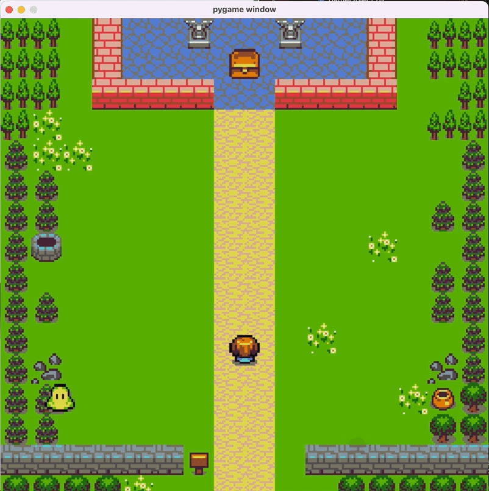

## Run

python3 main.py

## Screenshot

## Learning

1. Installing Python, Anaconda, and Pygame  
2. Creating and running a project  
3. Game window  
4. Game loops  
5. Drawing images  
6. GameObject, Player, and Enemy classes  
7. Event handlers  
8. Collision detection  
9. Updating multiple enemies  
10. End game logic